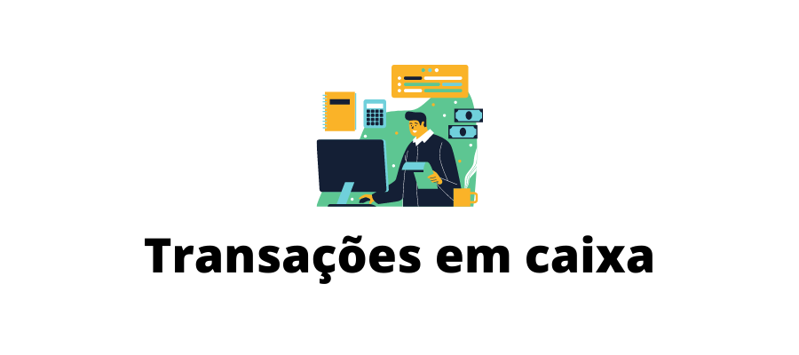
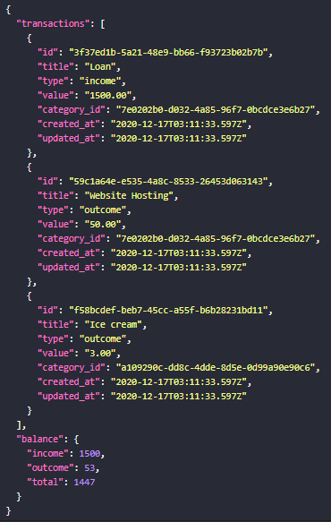
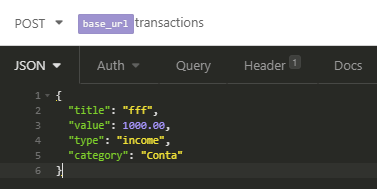
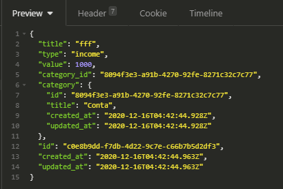

## Sobre o projeto

Nesse projeto e possível adicionar um transação e visualizar todas as transações feitas, também e pode ser feita um transação para retirar o valor mas só e permitido se tiver o valor para retirar e também e permitido excluir um transação.
Api consome dados em json ou arquivo csv.

### Listagem de Transação

Ao fim da listagem de transação e possível visualizar um balanço onde tem os valores que entram em caixa, os que foram retirados e o total em caixa.

### Criar Transação

Dados requeridos:

Retorno do server:

### yarn dev:server

para iniciar servidor execute yarn dev:server
